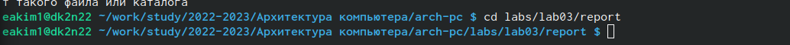
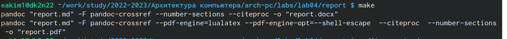
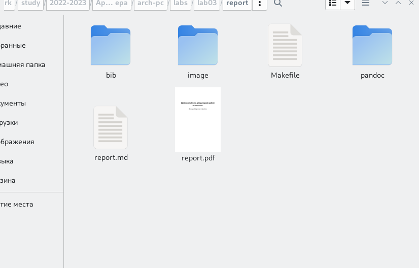
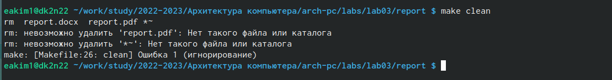
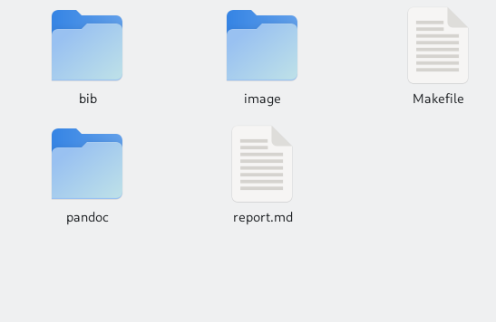
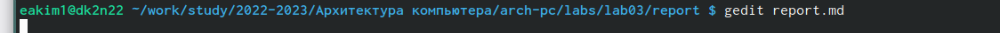

---
## Front matter
title: "Отчет по лабораторной работе 3"
subtitle: "Архитектура вычислительных систем"
author: "Ким Эрика Алексеевна"

## Generic otions
lang: ru-RU
toc-title: "Содержание"

## Bibliography
bibliography: bib/cite.bib
csl: pandoc/csl/gost-r-7-0-5-2008-numeric.csl

## Pdf output format
toc: true # Table of contents
toc-depth: 2
lof: true # List of figures
lot: true # List of tables
fontsize: 12pt
linestretch: 1.5
papersize: a4
documentclass: scrreprt
## I18n polyglossia
polyglossia-lang:
  name: russian
  options:
	- spelling=modern
	- babelshorthands=true
polyglossia-otherlangs:
  name: english
## I18n babel
babel-lang: russian
babel-otherlangs: english
## Fonts
mainfont: PT Serif
romanfont: PT Serif
sansfont: PT Sans
monofont: PT Mono
mainfontoptions: Ligatures=TeX
romanfontoptions: Ligatures=TeX
sansfontoptions: Ligatures=TeX,Scale=MatchLowercase
monofontoptions: Scale=MatchLowercase,Scale=0.9
## Biblatex
biblatex: true
biblio-style: "gost-numeric"
biblatexoptions:
  - parentracker=true
  - backend=biber
  - hyperref=auto
  - language=auto
  - autolang=other*
  - citestyle=gost-numeric
## Pandoc-crossref LaTeX customization
figureTitle: "Рис."
tableTitle: "Таблица"
listingTitle: "Листинг"
lofTitle: "Список иллюстраций"
lotTitle: "Список таблиц"
lolTitle: "Листинги"
## Misc options
indent: true
header-includes:
  - \usepackage{indentfirst}
  - \usepackage{float} # keep figures where there are in the text
  - \floatplacement{figure}{H} # keep figures where there are in the text
---

# Цель работы

Целью работы является освоение процедуры оформления отчетов с помощью
легковесного языка разметки Markdown
# Задание

1. В соответствующем каталоге сделайте отчёт по лабораторной работе No 3
в формате Markdown. В качестве отчёта необходимо предоставить отчёты
в 3 форматах: pdf, docx и md.
2. Загрузите файлы на github.

# Выполнение лабораторной работы
1. Открыли терминал 

2. Перешли в каталог курса и обновили локальный репозиторий с помощью команды "git pull"

![переход в каталог курса] (image/рис1.png){ #fig:001 width=90% }

3. Перешли в каталог с шаблонам отчета по лабораторной работе №3.

{ #fig:002 width=90% }

4. Проведите компиляцию шаблона с использованием Makefile c помощью команды "make".

{ #fig:003 width=90% }

5. 1. Заходим в каталог курса, подкатолог лабораторной работы №3 и проверяем на наличие файлов.

{ #fig:004 width=90% }

6. Удаляем полученые файлы с помощью команды "rm".

{ #fig:005 width=90% }

7. Убедимся, что файлы удалились.

{ #fig:006 width=90% }

8. Открываем файл repart.md с помощью тестового редактора, например gedit.

{ #fig:007 width=90% }

9. Заполнели и заполнели отчет.

# Выводы

Мы научились работать с makefie и научились делать отчет.
:::
